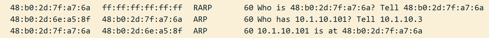

# rarp-replay

The goal of this application is to assist a physical network with MAC and IP address discovery of a migrated VM.

## Problem statement

Whenever a VM gets migrated to another host, the receiving hypervisor issues a reverse ARP (RARP) request containing the MAC address of the virtual NIC belonging to the VM. The purpose is to update the MAC address forwarding tables of the physical network connecting all hypervisors together. This is true for both [Vmware ESXI](https://kb.vmware.com/s/article/90045) and [Libvirt/Qemu](https://docs.openstack.org/nova/zed/configuration/config.html#workarounds.enable_qemu_monitor_announce_self).

In most cases, this is enough to restore network connectivity to the migrated VM. However, in some cases, this may not be enough. Consider the following situation, when the fabric is running the EVPN-VXLAN with ARP suppression enabled:

1. A VM gets migrated from a host attached to `switch-1` to a host attached to `switch-2`.
2. `switch-2` receives a RARP, updates its forwarding table and EVPN process generates a BGP Update containing (only) the MAC address of the VM (RARP requests do not contain IP addresses). 
3. When this Update reaches `switch-1`, it triggers a BGP route withdrawal, removing any prior MAC and/or MAC-IP routes in the fabric.
4. In case the migrated VM is silent or not actively sending any packets, external connectivity to it from other subnets will be disrupted since the fabric is not aware of the new MAC-IP binding. The connectivity is restored when the VM sends the next ARP request to refresh its local neighbor cache.

This is similar to a [problem](https://datatracker.ietf.org/doc/html/draft-ietf-bess-evpn-irb-extended-mobility-08#section-8.8) described in the extended MAC mobility RFC draft. 

## Solution

The solution to this is to issue an ARP request from the switch that receives the RARP request, before the MAC-IP withdrawal. Taking the situation described above as the baseline, here's how it changes with the help of `rarp-reply` application:

1. A VM gets migrated from a host attached to `switch-1` to a host attached to `switch-2`.
2. `switch-2` receives a RARP, updates its forwarding table and EVPN process generates a BGP Update. 
3. Each switch is running a special process that listens to incoming RARP packets and generates an ARP request to the VM for each received RARP request.
4. To build the ARP request, the switch uses its local ARP/ND cache to lookup the existing MAC-IP binding. This happens way before the Withdrawal arrives back from `switch-1`.
5. The ARP request triggers a reply from the migrated VM, which updates the local MAC-IP binding and generates another BGP Update containing both MAC and IP addresses of the VM.

## Applications

The current repository contains two packages.

### rarp-req

This is a Linux binary that can issue RARP requests with user-provided MAC address. It's only supposed to be used for testing of the `rarp-reply` application.

```
sudo ./rarp-req -mac 44:38:39:22:01:23 -intf eth0
```

### rarp-reply

This is a long-running, blocking process that connects to all available interfaces and starts listening to incoming RARP packets. As soon as it sees a RARP request, it builds a normal ARP, using its local MAC-IP as the source and VM's MAC-IP as the ARP target addresses. The ARP request is sent back over the same interface with the destination MAC extracted from the source MAC of the RARP request.

```
sudo ./rarp-reply
```

This should result in the following sequence of packets:


